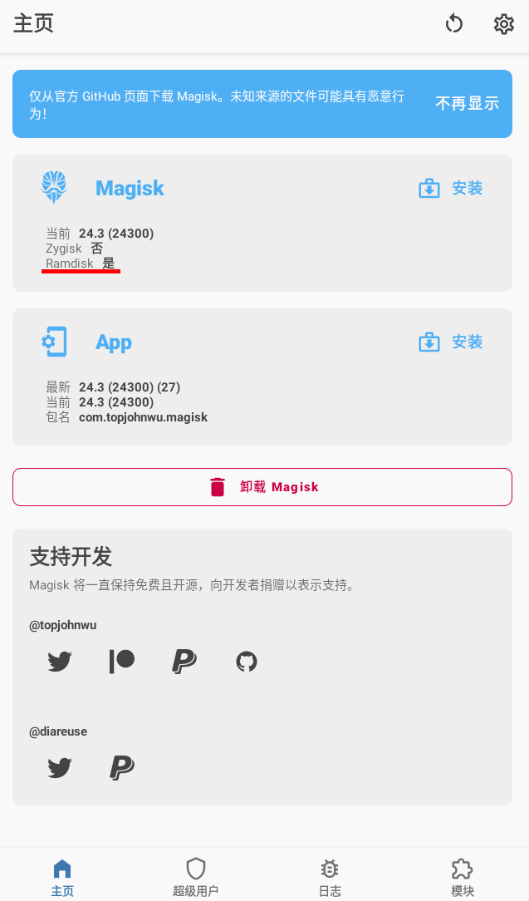

<!-- vim-markdown-toc GFM -->

* [安装](#安装)
	* [安装前的一些准备](#安装前的一些准备)
	* [修改镜像](#修改镜像)
	* [卸载](#卸载)
	* [Recovery 中的 Magisk](#recovery-中的-magisk)
	* [Samsung (System-as-root)](#samsung-system-as-root)
		* [在安装前请确认](#在安装前请确认)
		* [解锁 Bootloader](#解锁-bootloader)
		* [介绍](#介绍)
		* [升级系统](#升级系统)
		* [注意](#注意)
	* [第三方 Recovery](#第三方-recovery)

<!-- vim-markdown-toc -->

# 安装

如果你已经在你的设备中安装了 Magisk 本身, **非常推荐**直接使用 Magisk 应用中的 “直接安装”。以下的说明仅仅适用于初始化安装。

## 安装前的一些准备

在开始前:

- 这篇指南假设你会使用 `adb` 和 `fastboot`。
- 如果你打算安装自定义内核，请在 Magisk 安装完成之后再安装。
- 你需要解锁你的设备的 bootloader。具体信息请访问你的设备提供商的官网。

---

下载并安装最新的 [Magisk app](https://github.com/topjohnwu/Magisk/releases/latest).
 译者注：如果你发现你无法访问 github 或者下载速度很慢，请考虑从本地的镜像站下载 Magisk。[清华镜像站](https://mirrors.tuna.tsinghua.edu.cn/github-release/topjohnwu/Magisk/LatestRelease/)
 在软件主页，你应该看到如下界面:

Ramdisk 的结果代表着你的设备的启动分区是否具有 ramdisk。如果你的设备没有 ramdisk ，请在开始前阅读 [Magisk in Recovery](#magisk-in-recovery)

> _(不幸的是，有些设备的 bootloader 接受 ramdisk，但检测出来却是不支持 ramdisk. 如果你的设备是这样的, 请遵循 **拥有** ramdisk 的设备的安装指南。目前没有办法检测到这种情况，所以唯一的方法就是尝试。 幸运的是, 我们目前得知只有小米的设备有可能会出现这种情况, 所以大部分人可以忽略这条信息.)_

如果你在使用三星的设备，你可以跳转到 [三星设备安装指南](#samsung-system-as-root).

如果你的设备支持 ramdisk ，请去获取你的设备的 `boot.img`. 
如果你的设备不支持 ramdisk ，请去获取你的设备的 `recovery.img`. 
请从官方固件包或者第三方 ROM 中获得你说需要的文件.

现在，我们需要确认你的设备是否有专门的 `vbmeta` 分区.

- 如果你的官方固件中包含 `vbmeta.img`, 这意味着你的设备有专门的 `vbmeta` 分区
- 你也可以把你的手机了连接到电脑，通过以下命令来验证你的设备是否有单独的 `vbmeta` 分区: 
  `adb shell ls -l /dev/block/by-name`
- 如果你在执行上文的指令后，在输出中发现了 `vbmeta` 或 `vbmeta_a`、 `vbmeta_b`,这代表这你的设备具有单独的 `vbmeta`分区。
- 否则，你的设备没有专门的 `vbmeta` 分区。

因此，在现在，你应该知道并且准备了：

1. 你的设备是否支持 `ramdisk`
2. 你的设备是否有单独的 `vbmeta` 分区
3. 按照前文准备 `boot.img` 或 `recovery.img`
   让我们继续来 [修改镜像](#修改镜像).
   > 如果你手机中的数据对你很重要，请提前备份数据

## 修改镜像

- 把你的 boot/recovery 镜像复制到你的设备中。
- 在你的设备中打开 Magisk ，按下 Magisk 卡片中的 **安装**。
- 如果你要修改 `recovery.img`, 选中 **"恢复模式"** 选项
- 如果你的设备 **没有** 单独的 `vbmeta` 分区, 选中 **"修改 boot 映像中的的 vbmeta"** 选项。
- 选中 **"选择并修复镜像"** , 然后在内部存储中选择 boot/recovery 映像
- 开始安装，在安装完成后，将修改后的镜像复制到电脑中: 
  `adb pull /sdcard/Download/magisk_patched_[random_strings].img`
- 将 boot/recovery 镜像刷入你的设备. 
  对于大部分设备，你可以通过一下命令来刷入修改后的镜像: 
  `fastboot flash boot /path/to/magisk_patched.img` 或者  
  `fastboot flash recovery /path/to/magisk_patched.img`
- (可选的) 如果你的设备有专门的 `vbmeta` 分区, 你可以通过一下命令刷入修改后的 `vbmeta` 分区: 
  `fastboot flash vbmeta --disable-verity --disable-verification vbmeta.img`
- 重启，然后享受吧!
  > 注:如果你发现你的设备在刷入后无法启动，请将没有被修改的镜像刷入你的设备（将上文的命令中的修改后的镜像改为没有修改的镜像即可

## 卸载

最简单的卸载方法是在 Magisk 应用中直接卸载. 如果你在使用第三方 recovery , 把 Magisk APK 重命名为 `uninstall.zip` 然后以和其他刷机包一样的方法刷入.

## Recovery 中的 Magisk

如果你的设备的 boot 分区中没有 ramdisk, Magisk 只能劫持 recovery 分区. 对于这些设备, 你需要在每次你想要使用 Magisk 的时候 **重启到 recovery** .

当 Magisk 劫持 recovery 时, 有一个热键能让你  _真正_ 启动到恢复模式 . 每个设备都有进入recovery的特殊热键, 比如： Galaxy S10 的热键是  (电源键 + Bixby键 + 音量上). 你可以在网上搜索来获得你的设备的热键 . As soon as you press the key combo and the device vibrates with a splash screen, release all buttons to boot into Magisk. If you decide to boot into the actual recovery mode, **long press volume up until you see the recovery screen**.

综上所述, 在 recovery 中 安装 Magisk 后 **(从关机状态开始)**:

- **(正常开机) → (没有 Magisk 的 Android 系统)**
- **(Recovery Key Combo) → (Splash screen) → (Release all buttons) → (System with Magisk)**
- **(Recovery Key Combo) → (Splash screen) → (Long press volume up) → (Recovery Mode)**

(注释: 你 **不能** 在这种情况下用第三方 recovry 来安装 Magisk !!)

## Samsung (System-as-root)

> 译者注：以下部分是 **Samsung Only**，其他设备用户请忽略  
> 如果你正在使用一台**低于安卓 9**的三星设备，请不要参考以下内容   

### 在安装前请确认

- 安装 Magisk **会** 出发熔断机制。
- 第一次安装 Magisk **需要** 完全擦除一次设备 (这还 **不算上** 解锁 bootloader 的那一次)。请在安装前备份你的数据。
- 下载支持你的设备的 Odin (仅在 Windows 上可用)。

### 解锁 Bootloader

如果你尝试在现代的三星设备上解锁 bootloader ，你会收到一些警告。 最新引入的 `VaultKeeper` 服务会在一些情况下让 bootloader 拒绝接受仍和非官方的分区。

- 打开 **开发者选项 → OEM 解锁** 以允许设备的 bootloader 被解锁。
- 重启到下载模式 : 把你的设备关机，然后在启动时按你的设备特定的热键以进入下载模式。
- 长按音量上来解锁你的设备的 bootloader . **在自动重启后，你的设备的数据会被清空**
- 转到初始安装来准备. 可以跳过所有步骤，因为之后设备中的数据会被再清除一次 . **请在初始设置的时候把你的设备连接到互联网**
- 启用开发者模式 , 然后 **然后确认“OEM 解锁一栏变成灰色 ”** 这意味着 `VaultKeeper` 服务已经释放了 bootloader.
- Your bootloader now accepts unofficial images in download mode

### 介绍

- 使用  [samfirm.js](https://github.com/jesec/samfirm.js)或 [Frija](https://forum.xda-developers.com/s10-plus/how-to/tool-frija-samsung-firmware-downloader-t3910594), 或  [Samloader](https://forum.xda-developers.com/s10-plus/how-to/tool-samloader-samfirm-frija-replacement-t4105929) 来直接从三星的服务器下载你的设备的最新固件。
- 解压固件，然后将  `AP` 包复制到你的设备 . 它的名字一般是  `AP_[device_model_sw_ver].tar.md5`
- 在 Magisk 主界面的卡片中点击 **安装**
- 如果你的设备 **没有** 启动 ramdisk, 请点选 **"恢复模式"** 选项
- 在选项中选择 **"选择并修补文件"**, 然后选择 `AP` tar 包
- 开始安装,然后使用 ADB 把修补过的文件复制到你的电脑: 
  `adb pull /sdcard/Download/magisk_patched_[random_strings].tar` 
  **不要使用MTP** MTP 可能会损坏大文件 .
- 重启到下载模式.在你的电脑上打开 odin , 将 `magisk_patched.tar` 输入 `AP`, `BL`, `CP`, 以及 `CSC` (**不要刷入** `HOME_CSC` 因为我们需要从原生固件  **清除数据**)。
- 在完成刷写后，你的设备会自动重启 . 如果需要回复出厂设置，请允许.
- 如果你的设备 **没有** 启动 ramdisk, reboot to recovery now to enable Magisk (reason stated in [Magisk in Recovery](#magisk-in-recovery)).
- Install the Magisk app you've already downloaded and launch the app. It should show a dialog asking for additional setup.
- 让 Magisk app 自动完成之后的步骤然后重启 .享受吧!

### 升级系统

Once you have rooted your Samsung device, you can no longer upgrade your Android OS through OTA. To upgrade your device's OS, you have to manually download the new firmware zip file and go through the same `AP` patching process written in the previous section. **The only difference here is in the Odin flashing step: do NOT use the `CSC` tar, but instead use the `HOME_CSC` tar as we are performing an upgrade, not the initial install**.

### 注意

- **绝对不要** try to restore either `boot`, `recovery`, or `vbmeta` partitions back to stock! You can brick your device by doing so, and the only way to recover from this is to do a full Odin restore with data wipe.
- To upgrade your device with a new firmware, **NEVER** directly use the stock `AP` tar file with reasons mentioned above. **Always** patch `AP` in the Magisk app and use that instead.
- 绝对不要仅仅刷写  `AP` 分区 , 否则 Odin 可能会压缩  `/data` 分区的大小 . 请在升级时刷写  `AP` + `BL` + `CP` + `HOME_CSC`.

## 第三方 Recovery

> **这种安装方法已经过时，并且维护很少。请谨慎使用!**  
> 仅在你的手机的 boot 分区中有 ramdisk 的时候，才使用第三方 recovery 安装。不推荐在现代设备上使用第三方 recovery 安装 Magisk。. 如果你遇到了仍和问题 , 请使用 [修改镜像](#修改镜像) 的方法.

- 下载 Magisk APK
- 将文件的 `.apk` 扩展名重命名至 `.zip`, 比如: `Magisk-v24.0.apk` → `Magisk-v24.0.zip`. 如果你无法改变文件的扩展名 (比如 Windows), 使用 Android 上的文件管理或者 TWRP 上的文件管理重命名这个文件.
- 以刷入普通刷机包的方式刷入它.
- 请重启，然后查看 Magisk 应用是否被安装. 如果 Magisk 应用没有自动安装 , 请手动安装 APK.

> 警告 : 一些模块的 `sepolicy.rule` 可能被存储在 `cache` 分区. 请 **不要** 擦除 `CACHE` 分区！
