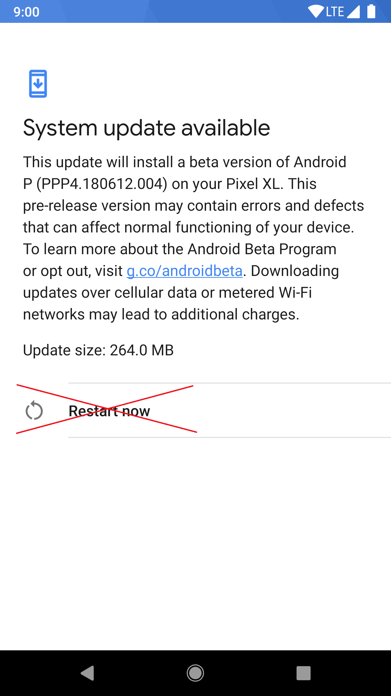

# 注意: 由于谷歌对OTA程序进行了修改，在Magisk应用程序的较新版本中，安装到非未使用插槽的功能被禁用。: https://twitter.com/topjohnwu/status/1303574238796808192

## OTA 升级指南
Magisk不会修改大多数只读分区，这意味着应用官方OTA要简单得多。这里有几种不同设备的应用OTA的教程，并在安装后保留Magisk（如果可能的话）。这只是一个一般的指南，因为每个设备的程序可能有所不同。

**注意: 为了应用OTA，你必须确保你自己没有以任何方式修改和只读的分区（如`/system`或`/vendor`）。即使将分区重新挂载为rw，也会篡改区块验证！**。

### 先决条件
- 请在开发者选项中禁用*自动系统更新*，这样它就不会在没有你确认的情况下安装OTA。不同的设备此设置的位置可能不同。

- 当有OTA的时候，首先进入（Magisk应用→卸载→还原原厂镜像）。**不要重启，否则你的Magisk会被卸载。**这将把Magisk修改过的分区从安装时的备份恢复到原样，以便通过OTA前的区块验证。**在做下面写的任何步骤之前，都需要这个步骤！**

### 具有 A/B 分区的设备

可以让OTA安装到未使用的插槽上，让Magisk应用将Magisk安装到更新的分区上。开箱即用的OTA安装可以无缝工作，安装后可以保留Magisk。

- 在恢复到出厂镜像后，像通常那样应用OTA（设置→系统→系统更新）。
- 等待安装完全完成（OTA的第1步和第2步），**不要按 "现在重启 "或 "重启 "按钮！** 而是进入（Magisk应用程序→安装→安装到不活动的插槽），将Magisk安装到更新的插槽。

 

- 安装完成后，按下Magisk应用程序中的重启按钮。在内部，Magisk应用程序会强制你的设备切换到更新的插槽，绕过任何可能的OTA后验证。

### "非A/B "设备
不幸的是，在这些设备上没有真正好的方法来应用OTA。下面的教程不会保留Magisk；你将不得不在升级后手动重新root你的设备，这将需要访问一台电脑。这些只是 "最佳做法"。

- 为了正确安装OTA，你必须在你的设备上安装你的出厂recovery。如果你安装了自定义recovery，你可以从以前的备份，或网上找到的 recovery，或OEM提供的工厂图像中恢复。
如果你决定从安装Magisk开始，而不修改你的恢复分区，你有几个选择，无论哪种方式，你最终都会得到一个Magiskroot的设备，但恢复仍然是库存的，没有被触动。
    - 如果支持的话，使用`fastboot boot <recovery_img>`来启动自定义恢复，并安装Magisk。
    - 如果你有一个库存镜像的副本，通过使用Magisk应用程序的 "补丁图像 "功能安装Magisk。
- 一旦你恢复到出厂recovery和其他镜像，下载OTA。可选择的是，一旦你下载了OTA更新的压缩包，找到一种方法来解压缩（因为它通常涉及到root）。
- 应用OTA并重新启动你的设备。这将使用你设备的官方库存OTA安装机制来升级你的系统。
- 一旦完成，你将会得到一个升级的、、未被ROOT的设备。你将不得不手动刷回Magisk。如果你想经常收到的OTA，可以考虑使用步骤1中的方法，在不接触恢复分区的情况下刷入Magisk。
